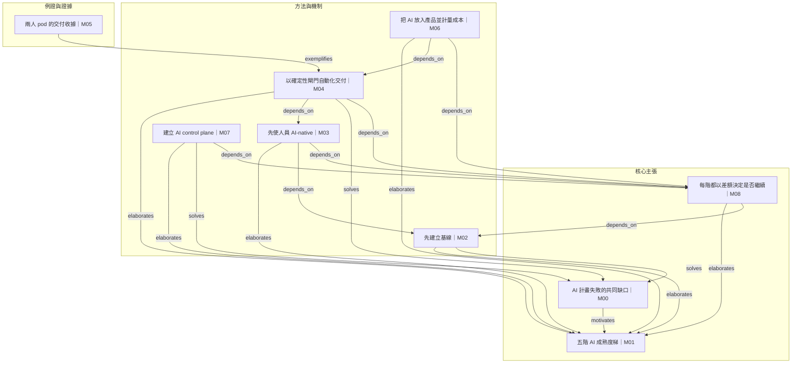

# 論證分層 — How to Make a Company AI-Native

## 分層對照

| 模塊 | 標題 | semantic_roles | 分層 |
|---|---|---|---|
| M00 | AI 計畫失敗的共同缺口 | claim, evidence, motivation | 核心主張 |
| M01 | 五階 AI 成熟度梯 | concept, framework | 核心主張 |
| M02 | 先建立基線 | procedure, measurement | 方法與機制 |
| M03 | 先使人員 AI-native | procedure, governance | 方法與機制 |
| M04 | 以確定性閘門自動化交付 | procedure, governance, risk_control | 方法與機制 |
| M05 | 兩人 pod 的交付收據 | case, evidence | 例證與證據 |
| M06 | 把 AI 放入產品並計量成本 | procedure, productization, cost_control | 方法與機制 |
| M07 | 建立 AI control plane | procedure, governance, compliance | 方法與機制 |
| M08 | 每階都以差額決定是否繼續 | decision_rule, measurement | 核心主張 |
