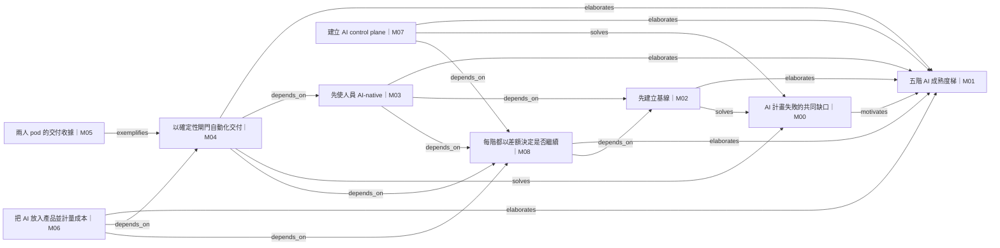

# 全圖 — How to Make a Company AI-Native

## 邊帳本

| ID | 來源 | 類型 | 目標 | 證據 span | 摘要 |
|---|---|---|---|---|---|
| E00 | M00 | motivates | M01 | `[1196,1305)` | 作者把缺 baseline、gates、governance、owner 指為方法存在的原因。 |
| E01 | M02 | elaborates | M01 | `[3857,5321)` | 「Climb to 00」把 Adopt 階段具體化為先建立 telemetry baseline。 |
| E02 | M03 | elaborates | M01 | `[5321,6257)` | 「00 to 01」把 Accelerate 階段具體化為標準工具鏈與 senior gate。 |
| E03 | M03 | depends_on | M02 | `[5290,5320)` | 前段明示其他工作都依賴 baseline；後段的 exit test 也需要 telemetry。 |
| E04 | M04 | elaborates | M01 | `[6257,7991)` | 「01 to 02」把 Automate 階段具體化為 sandbox agent、deterministic gates 與 staged rollout。 |
| E05 | M04 | depends_on | M03 | `[5553,5614)` | 文中明示無法在多套私有工作流上建立 agentic systems。 |
| E06 | M05 | exemplifies | M04 | `[7991,8360)` | 兩人 pod、122 個 merged PR 與 senior review 是前述 agent pipeline 的具體個案。 |
| E07 | M06 | elaborates | M01 | `[8360,9001)` | 「02 to 03」把 Scale 階段具體化為客戶付費功能與 model cost meter。 |
| E08 | M06 | depends_on | M04 | `[8418,8487)` | 文中以「Once delivery is agentic」明示產品化承接 agentic delivery。 |
| E09 | M07 | elaborates | M01 | `[9001,10115)` | 「03 to 04」把 AI-Native 階段具體化為 gateway、evals、RBAC、audit logs 與 impact mapping。 |
| E10 | M08 | elaborates | M01 | `[10115,10506)` | 全梯總規則以每階 delta 決定繼續或停止。 |
| E11 | M02 | solves | M00 | `[3857,5321)` | baseline 與 telemetry 直接補上 M00 所列的「no baseline」。 |
| E12 | M04 | solves | M00 | `[6257,7991)` | deterministic gates、shadow 與 human exception path 直接補上「no gates」。 |
| E13 | M07 | solves | M00 | `[9183,10115)` | gateway、evals、RBAC 與 immutable logs 直接補上「no governance」。 |
| E14 | M08 | depends_on | M02 | `[10155,10216)` | 總規則要求每階回到 baseline 讀 delta，因此 stop/go 判定依賴 M02 建立的量測基礎。 |
| E15 | M03 | depends_on | M08 | `[10155,10506)` | Accelerate 階的 adoption、velocity、quality exit test 受全梯 stop/go 規則約束。 |
| E16 | M04 | depends_on | M08 | `[10155,10506)` | Automate 階需以 error、manual hours 與 unit cost 的差額決定是否續行。 |
| E17 | M06 | depends_on | M08 | `[10155,10506)` | Scale 階需以產品價值與成本差額決定是否續行。 |
| E18 | M07 | depends_on | M08 | `[10155,10506)` | AI-Native 控制面仍須由 business outcomes 而非 activity 支持。 |

## 模塊溯源

- **M00** AI 計畫失敗的共同缺口 — `char_span: [609, 1306]` — AI 計畫大量終止，常見結構性原因是缺少 baseline、gates、governance 與 owner。
- **M01** 五階 AI 成熟度梯 — `char_span: [1306, 3857]` — 以可觀察的 Git／交付證據，把組織分成 Adopt、Accelerate、Automate、Scale、AI-Native 五階；每階只在商業差額支持時繼續攀升。
- **M02** 先建立基線 — `char_span: [3857, 5321]` — 在改變工程系統前量測 velocity、quality、AI adoption 與 cost per developer。
- **M03** 先使人員 AI-native — `char_span: [5321, 6257]` — 統一工具鏈與 prompt patterns。
- **M04** 以確定性閘門自動化交付 — `char_span: [6257, 7991]` — 選一個每日發生、模式明確、跨多系統且成本可量化的工作流。
- **M05** 兩人 pod 的交付收據 — `char_span: [7991, 8360]` — 三個月合併 122 個 pull requests，且文中宣稱品質維持穩定。
- **M06** 把 AI 放入產品並計量成本 — `char_span: [8360, 9001]` — 把同一套交付紀律用於客戶付費的 retrieval、classification、document automation 或 agentic features。
- **M07** 建立 AI control plane — `char_span: [9001, 10115]` — 以單一 model gateway 路由所有 AI calls，按 repo、model 與成本設 policy。
- **M08** 每階都以差額決定是否繼續 — `char_span: [10115, 10506]` — 每次升階後回到 baseline，比較 cycle time、error rate、manual hours 與 cost per workflow unit。
