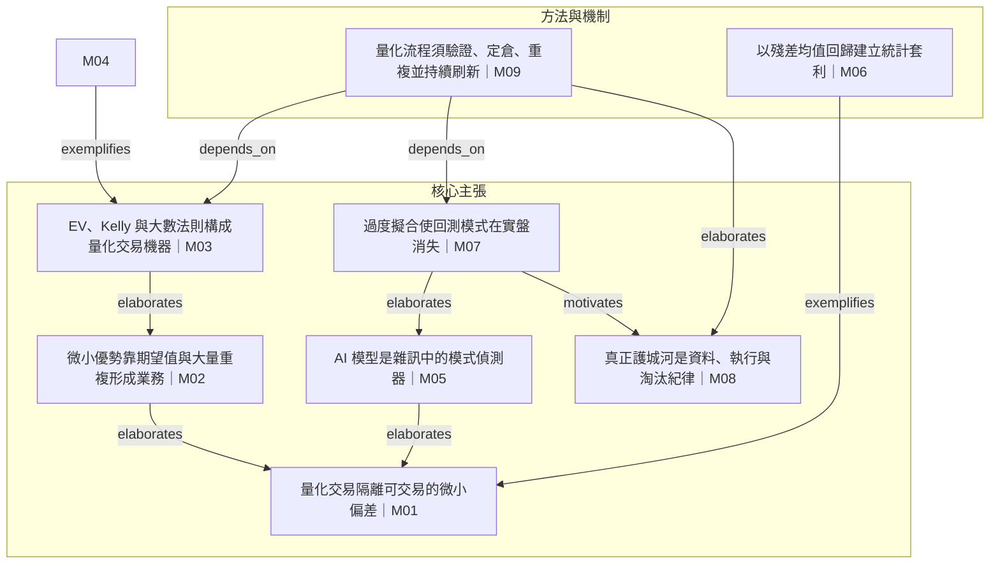

# 論證分層 — Quant Trading Is Not Prediction

## 分層對照

| 模塊 | 標題 | semantic_roles | 分層 |
|---|---|---|---|
| M01 | 量化交易隔離可交易的微小偏差 | concept, problem_framing, contrast | 核心主張 |
| M02 | 微小優勢靠期望值與大量重複形成業務 | concept, mechanism, contrast | 核心主張 |
| M03 | EV、Kelly 與大數法則構成量化交易機器 | concept, mechanism, risk_management | 核心主張 |
| M04 | Renaissance 作為微小優勢規模化的案例 | example, historical_context | 其他 |
| M05 | AI 模型是雜訊中的模式偵測器 | concept, historical_context, analogy | 核心主張 |
| M06 | 以殘差均值回歸建立統計套利 | procedure, example, mechanism | 方法與機制 |
| M07 | 過度擬合使回測模式在實盤消失 | claim, diagnosis, validation | 核心主張 |
| M08 | 真正護城河是資料、執行與淘汰紀律 | claim, operational_discipline | 核心主張 |
| M09 | 量化流程須驗證、定倉、重複並持續刷新 | synthesis, checklist, procedure | 方法與機制 |
