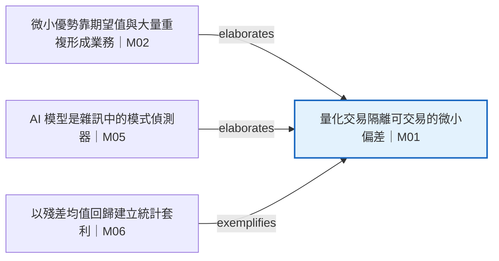

# 焦點鄰域 — 量化交易隔離可交易的微小偏差 (M01)

一階上游 3、下游 0。

## 目前模塊

| 欄位 | 值 |
|---|---|
| module_id | M01 |
| 標題 | 量化交易隔離可交易的微小偏差 |
| char_span | `[0, 900]` |
| module_type | TeachingModule |
| semantic_roles | concept, problem_framing, contrast |
| 摘要 | 量化交易不是預測整體市場方向，而是剝除市場、產業、因子、流動性與暫時壓力後，隔離略低於隨機的資產特定偏差。 |

## 上游輸入

| 來源 | 標題 | 邊類型 | 證據 span |
|---|---|---|---|
| M02 | 微小優勢靠期望值與大量重複形成業務 | elaborates | `[900,1401)` |
| M05 | AI 模型是雜訊中的模式偵測器 | elaborates | `[2747,3450)` |
| M06 | 以殘差均值回歸建立統計套利 | exemplifies | `[3450,4181)` |

## 下游流向

| 目標 | 標題 | 邊類型 | 證據 span |
|---|---|---|---|
| — | — | — | — |

## 關聯邊帳本

| ID | 來源 | 類型 | 目標 | 證據 span | 摘要 |
|---|---|---|---|---|---|
| E00 | M02 | elaborates | M01 | `[900,1401)` | 微小正優勢經大量重複形成業務，詳述 M01 所稱「略低於隨機」偏差為何仍可交易。 |
| E05 | M05 | elaborates | M01 | `[2747,3450)` | 模型估計雜訊資料中的期望結果，詳述量化交易不是水晶球式整體預測。 |
| E06 | M06 | exemplifies | M01 | `[3450,4181)` | 統計套利移除市場、產業與因子曝險後交易殘差，是隔離較乾淨錯價的具體方法實例。 |

