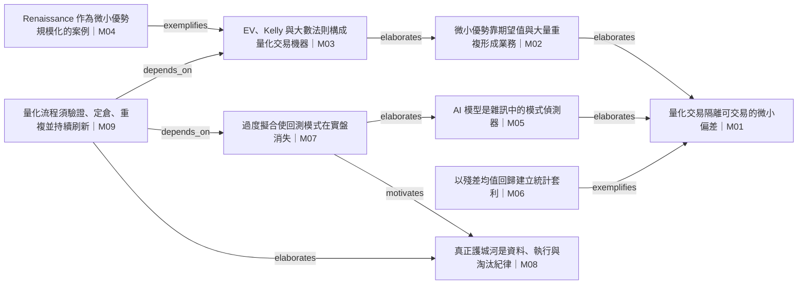

# 全圖 — Quant Trading Is Not Prediction

## 邊帳本

| ID | 來源 | 類型 | 目標 | 證據 span | 摘要 |
|---|---|---|---|---|---|
| E00 | M02 | elaborates | M01 | `[900,1401)` | 微小正優勢經大量重複形成業務，詳述 M01 所稱「略低於隨機」偏差為何仍可交易。 |
| E01 | M03 | elaborates | M02 | `[1401,2003)` | EV、Kelly 與大數法則分別展開 M02 的平均獲利、定倉與重複機制。 |
| E02 | M04 | exemplifies | M03 | `[2003,2747)` | Renaissance／Medallion 被作者作為微小優勢、正確定倉與大規模重複的具體案例。 |
| E03 | M07 | motivates | M08 | `[4181,5347)` | 過度擬合與回測失真問題，構成資料、執行、風險控制與淘汰紀律成為護城河的動機。 |
| E04 | M09 | elaborates | M08 | `[5347,6497)` | 每日檢核 EV、真實性、風險、獨立重複、成本與擁擠，將操作紀律展開為可執行流程。 |
| E05 | M05 | elaborates | M01 | `[2747,3450)` | 模型估計雜訊資料中的期望結果，詳述量化交易不是水晶球式整體預測。 |
| E06 | M06 | exemplifies | M01 | `[3450,4181)` | 統計套利移除市場、產業與因子曝險後交易殘差，是隔離較乾淨錯價的具體方法實例。 |
| E07 | M07 | elaborates | M05 | `[4181,4798)` | 過度擬合說明模式偵測器如何找到不真實的模式，補足 M05 模型觀的限制。 |
| E08 | M09 | depends_on | M03 | `[5347,6497)` | 最終流程中的正 EV、定倉與獨立重複，依賴 M03 的三件式機制。 |
| E09 | M09 | depends_on | M07 | `[5347,6497)` | 部署前證明訊號真實、納入成本並監測衰退，依賴 M07 的測試與實務驗證要求。 |

## 模塊溯源

- **M01** 量化交易隔離可交易的微小偏差 — `char_span: [0, 900]` — 量化交易不是預測整體市場方向，而是剝除市場、產業、因子、流動性與暫時壓力後，隔離略低於隨機的資產特定偏差。
- **M02** 微小優勢靠期望值與大量重複形成業務 — `char_span: [900, 1401]` — 單筆交易近乎無意義的微小優勢，只要平均結果為正，經大量重複即可形成可持續的業務；問題應從「這筆會不會成功」改為「重複一萬次後平均是否獲利」。
- **M03** EV、Kelly 與大數法則構成量化交易機器 — `char_span: [1401, 2003]` — 期望值判定交易是否值得存在，Kelly Criterion 決定資本風險，大數法則解釋需要多少重複才能讓優勢與運氣區分；缺少任一環節都會破壞系統。
- **M04** Renaissance 作為微小優勢規模化的案例 — `char_span: [2003, 2747]` — 作者主張規模化的小優勢形成 discretionary trader 難以競爭的績效。
- **M05** AI 模型是雜訊中的模式偵測器 — `char_span: [2747, 3450]` — 交易模型不是水晶球，而是在雜亂價格資料中偵測模式，嘗試估計恐慌、趨勢、流動性失衡或暫時錯價等隱藏狀態下的期望結果。
- **M06** 以殘差均值回歸建立統計套利 — `char_span: [3450, 4181]` — 從股票報酬移除市場、產業與共同因子曝險，取得殘差。
- **M07** 過度擬合使回測模式在實盤消失 — `char_span: [4181, 4798]` — 模型會找到不存在的模式並記住歷史；真正的優勢在測試流程，而不是漂亮的回測模型。
- **M08** 真正護城河是資料、執行與淘汰紀律 — `char_span: [4798, 5347]` — 模型、算力、論文與公式普及後，量化交易的護城河主要是乾淨資料、執行、辨識假訊號、承受變異的部位、無情緒重複與及時淘汰衰退策略。
- **M09** 量化流程須驗證、定倉、重複並持續刷新 — `char_span: [5347, 6497]` — 判定訊號是否有正期望值且不是過度擬合。
