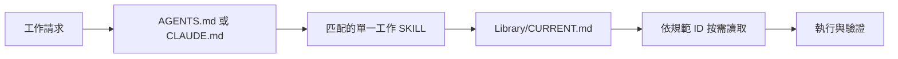

# Agent 技能化運作流程

本文件供人查閱已採用的運作架構；不取代、也不重複 v0.3 規範正文。

## 目的

- 降低每次工作的上下文載入量。
- 以按需讀取提高定位與讀取速度。
- 讓 `Library/規範` 成為規則的單一真相來源。

## 架構與目錄責任

| 位置 | 責任 |
|---|---|
| `AGENTS.md` / `CLAUDE.md` | 固定的人機入口；提供全域溝通規則與模組／技能入口摘要。 |
| `.agents/` | 全域規則與舊模組入口；保留既有工作脈絡，不作新版規範的權威來源。 |
| `.agents/skills/` | 工作型 SKILL；定義最短工作程序，透過規範 ID 取用規則。 |
| `Library/CURRENT.md` | 固定的規範路由入口；宣告目前版本，將穩定 ID 映射到 canonical 規範。 |
| `Library/規範/` | 可獨立讀取的 canonical 規範；唯一可修改的規則內容來源。 |
| `Library/archive/` | 唯讀的版本快照；供追溯、比對與遷移查核，非執行時規則來源。 |

固定入口分工如下：人先由儲存庫根目錄的 `AGENTS.md` 或 `CLAUDE.md` 取得全域指引與工作 SKILL；規範解析一律由 [Library/CURRENT.md](CURRENT.md) 開始。SKILL 只記錄穩定 ID，**不得寫死規範實體檔名或路徑**。

## 穩定規範 ID

以下八個 ID 是 SKILL 與規範之間的穩定介面。實際路徑、版本與映射以 [CURRENT](CURRENT.md) 為準。

| ID | 用途 |
|---|---|
| `design-principles` | 判斷跨層設計取捨時的共同原則。 |
| `module-layer` | 處理素材、模塊與其生命週期。 |
| `structure-layer` | 處理概念之間的結構與關係。 |
| `practice-layer` | 處理練習、回饋與演講場次。 |
| `skill-registry` | 處理技能節點與登記操作。 |
| `validation` | 處理驗收、度量與試跑檢查。 |
| `identity-terminology` | 統一文本身份、欄位與術語。 |
| `version-decisions` | 處理版本、凍結與待裁決事項。 |

## 讀取流程

每次工作只開啟一個匹配的工作型 SKILL。SKILL 必先讀 `CURRENT.md`，再以 ID 按需讀取所需的 canonical 規範；不得一次載入全部 `Library/`。

當工作範圍變動時，先回到 `CURRENT.md` 解析新增的 ID，再讀取對應規範；不以先行載入整個 Library 來預防遺漏。

## 工作型 SKILL

下表的「應讀 ID」是工作開始時的最小範圍；遇到跨層產物時，再按工作範圍增加相關 ID。所有 SKILL 均先讀 `CURRENT.md`。

| SKILL | 職責 | 應讀 ID |
|---|---|---|
| `ingest-text` | 將輸入文本分類、收錄並建立可追溯身份。 | `module-layer`、`identity-terminology` |
| `modularize-text` | 將文本拆成可替換、可連結的模塊。 | `design-principles`、`module-layer`、`identity-terminology` |
| `extract-structure` | 抽取、判定與維護概念結構。 | `structure-layer`、`identity-terminology` |
| `generate-practice` | 由學習內容產生可驗證的練習。 | `practice-layer`、`identity-terminology` |
| `run-speaking-session` | 執行演講場次並記錄可回填的結果。 | `practice-layer`、`module-layer`、`identity-terminology` |
| `manage-skill-registry` | 管理技能登記，並隔離登記層與其他層的責任。 | `skill-registry`、`module-layer`、`structure-layer`、`identity-terminology` |
| `render-knowledge-views` | 將既有知識投影為閱讀、講述或視覺視圖。 | `design-principles`、`module-layer`、`structure-layer`、`identity-terminology` |
| `validate-learning-pipeline` | 驗收學習流程與其產物；依受測範圍擴充讀取。 | `validation`、受測層的 ID；涉及凍結時加讀 `version-decisions` |

## 規範更新與改名

規範內容只改 `Library/規範/`。每次規範版本或映射變動，同步更新 `CURRENT.md` 的版本與 ID 映射；`Library/archive/` 一律唯讀。

規範實體檔改名時，只更新 `CURRENT.md` 的該 ID 映射列；ID 與引用該 ID 的 SKILL 都不變。只有概念範圍或 ID 本身改變才是 breaking change，必須更新相關 SKILL 並重新驗證其解析與工作結果。

發生衝突時，依下列順序裁決：

1. 新版 `Library/規範/` 的 canonical 規則。
2. `.agents/` 的全域規則與舊模組入口。
3. `AGENTS.md` / `CLAUDE.md` 的入口摘要。

archive 僅供歷史查核，不參與上述執行時優先序。

## 驗證、Git、交接與推送

- 驗證每個 ID 可由 `CURRENT.md` 解析到 canonical 規範，並確認 SKILL 不含實體規範檔名。
- 驗證 SKILL 的格式、引用範圍與工作結果；只讀完成工作所需的規範。
- 提交前以 `git status` 確認範圍，只暫存本次變更；提交後再次確認工作樹。
- 需要推送時，同次變更建立 `.agents/handover/<commit-id>.md`；檔案以 commit ID 命名，既有交接檔不可覆寫。
- 推送前確認交接檔、規範／SKILL 變更與驗證結果屬於同一提交範圍。

## 原始快照

原始 v0.3 r1 快照路徑為 `Library/archive/模塊層結構層練習層規範_v0_3_r1.md`。它用於歷史備查、canonical 規範拆分後的比對，以及遷移查核；日常工作與新規則均以 `CURRENT.md` 所解析的 `Library/規範/` 為準。
