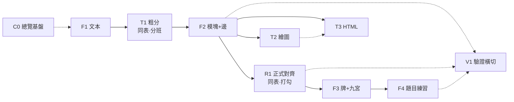

# C0 · 作業代號與管線總覽

> **歸屬提案**：原 M0「專案基盤」改名 **C0**（Catalog／總覽基盤）。本檔為代號圖例與管線分布說明。  
> **狀態**：討論結論已採方案 A 延伸；**尚未改** `Library/規範/agent-ops.md` 登記表。落表須另確認。  
> **畫圖**：本檔僅用 Markdown／Mermaid，不呼叫 archify 或其他外掛渲染器。

## 成品標號規則

`C{序號}` 是**成品**（一份管線／流程圖）。括號只標**範圍**。

```text
C{序號}-({範圍})
C{序號}-({範圍}):: {參與塊, …}    ← 僅當「不是該範圍下的全部參與塊」時才列
```

| 段 | 意思 |
|---|---|
| `C{序號}` | 成品編號（C0 名下的第 n 份圖／說明成品） |
| `({範圍})` | 覆蓋的 F 跨度，如 `(F1-F4)` |
| `::` 後 | **省略清單**：該範圍內／約定的參與塊**全部**入圖時，**不列** |
| | **子集清單**：只畫部分塊時，才在 `::` 後列出實際參與者 |

本檔成品標號：

| 標號 | 成品 | 說明 |
|---|---|---|
| **`C1-(T3)`** | **HTML 管理中心** | 索引／搜尋／分類／預覽（`docs/html-hub.html`、`tools/viz/html-hub.py`）；現行實作仍掛 M2 |
| **`C2-(F1-F4)`** | 全管線總圖 | 全部參與塊入圖，**不**加 `::` 清單 |

子集舉例（若有）：`C3-(F1-F2):: F1, T1, F2`（未含 R1／F3／F4／T／V 等）。

---

## 代號一覽

| ID | 名稱 | 一句話 | 備註 |
|---|---|---|---|
| **C0** | 總覽基盤（原 M0） | 入口、治理可達、**本代號圖例與管線總圖** | 不實作 F／T／R 產物邏輯 |
| **C1** | HTML 管理中心 | 大量 HTML 輸出的統一索引、篩選、預覽入口 | 成品標號 `C1-(T3)`；落表前仍記 M2 |
| **F1** | 文本 | 收錄、Inbox／DOC 收錄面 | 原 M1 方向 |
| **T1** | 技能粗分 | 文本進門後分班／路由 | 與 R1 **共用技能登記簿** |
| **F2** | 模塊＋邊 | 切模塊、抽邊 | 原 M2 結構半邊 |
| **R1** | 正式對齊 | `align(module)` 打勾／pending | 同表異站；表維護歸同一登記面 |
| **F3** | 策略牌＋九宮 | 場景／選塊練習入口 | |
| **F4** | 題目練習 | 暫定 | ≠ 舊「登記與驗證」 |
| **T2** | 繪圖 | SVG／概念圖等 | 吃 F2；與 T3 **可平行或串行** |
| **T3** | HTML | hub／頁面輸出 | 吃 F2／視圖；與 T2 **可平行或串行**；**C1** 為此站成品 |
| **V1** | 驗證 | 升格／開版**證據**；橫切抽查 | **暫空**：啟用條件／必做檢查／登記面列名尚未補；不是學習迴圈本身 |

舊 **M1～M4**：方案 A 下廢止舊義、**不回收號**（落表時標已廢止）。

---

## 管線分布（誰在哪一層）

```text
C0  總覽／圖例／基盤
│
├─ 主管線 F
│    F1 文本 → T1 粗分 → F2 模塊+邊 → R1 正式對齊 → F3 牌+九宮
│                                              ↘ F4 題目練習
│
├─ 展示旁路 T（自 F2 分出；T2／T3 **可串行或平行**）
│    T2 繪圖
│    T3 HTML
│    （亦可 T2 → T3，視成品而定）
│
└─ 驗證橫切 V
     V1 可抽查 F／T／R 各站（服務草案升格／開版門檻）
```

技能登記簿：**一本索引**；T1＝分班用法，R1＝打勾用法；維護規範寫在同一登記面（不拆兩套表）。

---

## 流程（主路徑）

```text
[C0 基盤]
    │
    v
[F1 文本] ──收錄──> [T1 粗分] ──路由──> [F2 模塊+邊]
                                              │
                          ┌───────────────────┼───────────────────┐
                          v                   v                   v
                     [T2 繪圖]            [R1 正式對齊]         （產物進練習）
                     [T3 HTML]                │
                   （可平行／可串行）            v
                                       [F3 牌+九宮] ──> [F4 題目練習]

     ············ V1 驗證（橫切，不插入為必經加工站）············
```

### Mermaid（可選預覽）



> T2／T3 皆可直接出自 F2；虛線 `T2 -.-> T3` 表示**可選串行**，非常駐必經。

---

## C1-(T3) HTML 管理中心

| 項 | 內容 |
|---|---|
| 標號 | `C1-(T3)`（僅 T3 範圍，全量不列 `::`） |
| 產物 | HTML 索引、搜尋、分類、單檔／多檔預覽 |
| 路徑 | `docs/html-hub.html`、`tools/viz/html-hub.py` |
| 現行掛靠 | 仍屬生效 **M2**（落表後改掛 T3／C1 敘述） |

## C2-(F1-F4) 預設含哪些塊

標號本身是 `C2-(F1-F4)`（全部入圖，**不**加 `::` 清單）。  
下列僅作圖例說明「全部」指什麼，不是標號的一部分：

| 參與塊 | 角色 |
|---|---|
| F1 | 文本 |
| T1 | 技能粗分（同表·分班） |
| F2 | 模塊＋邊 |
| R1 | 正式對齊（同表·打勾） |
| F3 | 策略牌＋九宮 |
| F4 | 題目練習 |
| T2 | 繪圖 |
| T3 | HTML（含 C1 管理中心為此站成品） |
| V1 | 驗證橫切 |

子集成品才寫例如：`C3-(F1-F2):: F1, T1, F2`。

---

## 與現行登記表的差（落表前）

| 現行 agent-ops | 本提案 |
|---|---|
| M0 專案基盤 | **C0**（加：代號圖例與管線總圖） |
| M1～M4 … | 改 F／T／R／V 方案；舊 M 號廢止不回收 |
| M2 含視圖 | 結構 → F2；繪圖 → T2；**HTML 管理中心 → C1-(T3)** |

落表動作（待你確認）：改 `agent-ops` 登記表、看板 M0 節改 C0、Skill 對照表、本檔狀態改「已反映」。
