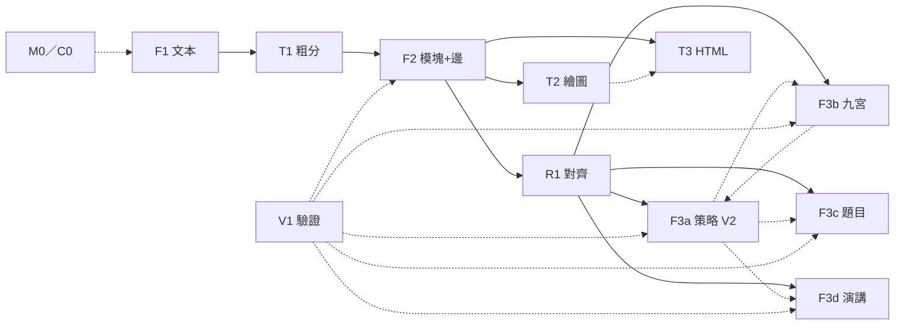

# C0 · 作業代號與管線總覽

> **歸屬**：**C0** 為常設作業模塊 **M0**（專案基盤）名下的總覽／成品代號，**不取代 M0**、不另開作業模塊。本檔為代號圖例與管線分布說明。  
> **狀態**：**已反映**（2026-07-22 落表 M0＋F／T／R／V；**2026-07-23** F3 拆四平行小塊、舊 F4 併入 F3c、M5 不登記改掛 F／F3a）。  
> **畫圖**：本檔僅用 Markdown／Mermaid，不呼叫 archify 或其他外掛渲染器。

## 成品標號規則

`C{序號}` 是**成品**（一份管線／流程圖）。括號只標**範圍**。

```text
C{序號}-({範圍})
C{序號}-({範圍}):: {參與塊, …}    ← 僅當「不是該範圍下的全部參與塊」時才列
```

| 段 | 意思 |
|---|---|
| `C{序號}` | 成品編號（C0 名下的第 n 份圖／說明成品；**C0 本身**指 M0 總覽圖例） |
| `({範圍})` | 覆蓋的 F 跨度，如 `(F1-F3)`（F3＝F3a～F3d 全家） |
| `::` 後 | **省略清單**：該範圍內／約定的參與塊**全部**入圖時，**不列** |
| | **子集清單**：只畫部分塊時，才在 `::` 後列出實際參與者 |

本檔成品標號：

| 標號 | 成品 | 說明 |
|---|---|---|
| **`C1-(T3)`** | **HTML 管理中心** | 索引／搜尋／分類／預覽（`docs/html-hub.html`、`tools/viz/html-hub.py`）；掛作業模塊 **T**、站位 T3 |
| **`C2-(F1-F3)`** | 全管線總圖（成品代號） | 含 F3a～F3d；全部參與塊入圖，**不**加 `::` 清單。**真相**＝本檔 ASCII／Mermaid；尚無獨立現行 HTML 投影（舊示意已封存） |

舊標號 `C2-(F1-F4)`：**作廢**（F4 已併入 F3c）。子集舉例：`C3-(F1-F2):: F1, T1, F2`。  
HTML 批次封存（2026-07-23）：見 [../archive/html-2026-07-23/README.md](../archive/html-2026-07-23/README.md)；含舊提案管線圖、ftrv 示意、specs assets、archify-demo、引水梯 views 等。活區僅保留 hub＋`flow-map.html`。

---

## 代號一覽

### 作業模塊（登記表）

| ID | 名稱 | 一句話 |
|---|---|---|
| **M0** | 專案基盤（常設） | CI／入口／雜項；**C0** 圖例歸其名下 |
| **F** | 主管線 | 站位 F1、F2、**F3a～F3d**（平行可互調） |
| **T** | 轉換／視圖 | 站位 T1～T3（含 C1） |
| **R** | 正式對齊 | 站位 R1 |
| **V** | 驗證橫切 | 站位 V1 |

舊 **M1～M4**：已廢止、**不回收號**。  
**M5**：提案已處理完成——**不登記**；內容掛 **F／F3a（策略 V2）**。

### 站位與成品（非作業模塊）

| ID | 名稱 | 一句話 | 備註 |
|---|---|---|---|
| **C0** | 總覽／圖例代號 | 入口、治理可達、**本代號圖例與管線總圖** | 屬 **M0** |
| **C1** | HTML 管理中心 | 大量 HTML 索引／篩選／預覽 | `C1-(T3)`；屬 **T** |
| **F1** | 文本 | 收錄、Inbox／DOC 文檔出口 | 屬 **F**；DOC 三桶＝完成後轉桶，≠ 模塊收納 |
| **T1** | 技能粗分 | 技能登記簿分班 | 屬 **T**；與 R1 **同表** |
| **F2** | 模塊＋邊 | 切模塊、抽邊 | 屬 **F** |
| **R1** | 正式對齊 | `align(module)` 打勾／pending | 屬 **R**；同表異站 |
| **F3** | （家族名） | F3a～F3d 四平行小塊的合稱 | 屬 **F**；**不是**單一流水線站 |
| **F3a** | 策略 V2／最小一步 | 導航循環＋決策牌＋決策訓練器 v2 | 屬 **F**；平行可互調 |
| **F3b** | 九宮 | 攝入／練習格位容器 | 屬 **F** |
| **F3c** | 題目練習 | 出題與作答 | 屬 **F**；**承接舊 F4** |
| **F3d** | 演講 | 合規鏈場次 | 屬 **F** |
| **F4** | （已併入 F3c） | — | **不回收號**作別義；摘要勿再當現行站位 |
| **T2** | 繪圖 | SVG／概念圖等 | 屬 **T**；吃 F2；與 T3 可平行或串行 |
| **T3** | HTML | hub／頁面輸出 | 屬 **T**；**C1** 為此站成品 |
| **V1** | 驗證 | 升格／開版證據；橫切抽查 | 屬 **V** |

**F3a～F3d 互調**：只許明示呼叫（next／入口），不建成唯一總線；四格皆可作當前入口。

**F3a 最小一步（導航循環）**：

```text
真實目的 → 必要判斷 → 能選就選／不能則補最小知識再選
→ 選擇改變後續牌組 → 執行下一步 → 再定位
```

---

## 管線分布（誰在哪一層）

```text
M0／C0  總覽／圖例／基盤
│
├─ 作業模塊 F（主管線）
│    F1 文本 → T1 粗分 → F2 模塊+邊 → R1 正式對齊
│                              │
│              ┌───────────────┼───────────────┐
│              v               v               v
│           F3a 策略 V2     F3b 九宮      F3c 題目
│           （最小一步）         │               │
│              └─────── 平行可互調 ──────┘
│                              │
│                           F3d 演講
│
├─ 作業模塊 T（展示旁路；自 F2 分出；T2／T3 **可串行或平行**）
│    T2 繪圖
│    T3 HTML
│
├─ 作業模塊 R（正式對齊）
│    R1
│
└─ 作業模塊 V（驗證橫切）
     V1 可抽查 F／T／R 各站（含 F3a～F3d）
```

技能登記簿：**一本索引**；T1＝分班，R1＝打勾。F3a 的 TextCard／訓練標籤**不寫入**登記簿。

---

## 流程（主路徑）

```text
[M0／C0 基盤]
    │
    v
[F1 文本] ──收錄──> [T1 粗分] ──路由──> [F2 模塊+邊]
                                              │
                    ┌─────────────────────────┼─────────────────────────┐
                    v                         v                         v
               [T2／T3 展示]            [R1 正式對齊]              （進 F3 家族）
                                              │
                    ┌──────────── F3 四平行小塊（可互調）────────────┐
                    v              v              v              v
              [F3a 策略 V2]   [F3b 九宮]   [F3c 題目]   [F3d 演講]
              （最小一步）

     ············ V1 驗證（橫切，不插入為必經加工站）············
```

### Mermaid（可選預覽）



> F3a～F3d 虛線＝可互調，非強制順序。T2／T3 可選串行。

---

## C1-(T3) HTML 管理中心

| 項 | 內容 |
|---|---|
| 標號 | `C1-(T3)` |
| 產物 | HTML 索引、搜尋、分類、單檔／多檔預覽 |
| 路徑 | `docs/html-hub.html`、`tools/viz/html-hub.py` |
| 掛靠 | 作業模塊 **T**、站位 **T3** |

## C2-(F1-F3) 預設含哪些塊

標號 `C2-(F1-F3)`（F3＝a～d 全家；全量不加 `::`）：

| 參與塊 | 角色 |
|---|---|
| F1 | 文本 |
| T1 | 技能粗分 |
| F2 | 模塊＋邊 |
| R1 | 正式對齊 |
| F3a | 策略 V2／最小一步 |
| F3b | 九宮 |
| F3c | 題目 |
| F3d | 演講 |
| T2 | 繪圖 |
| T3 | HTML（含 C1） |
| V1 | 驗證橫切 |
