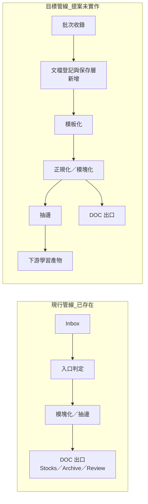
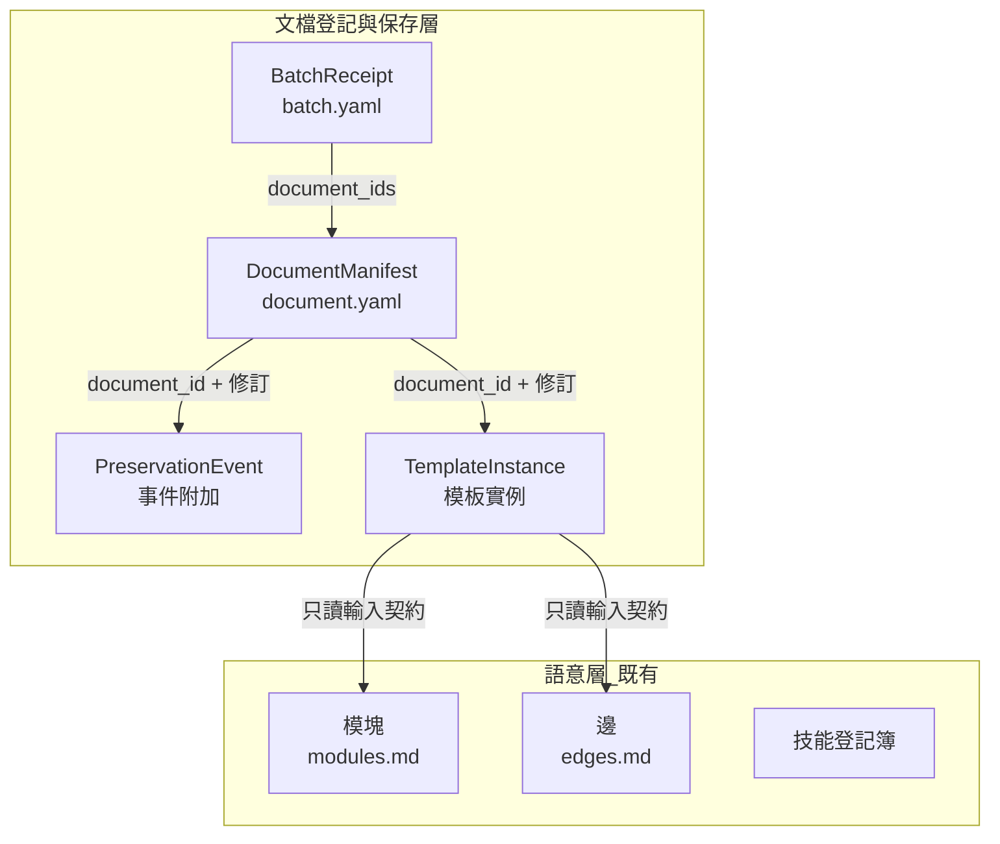
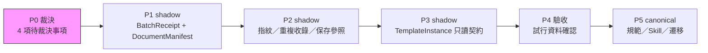

# 文檔中心收錄管線 — 可視化說明

- 短代號：D7

日期：2026-07-14
狀態：草稿
裁決來源：無
實作參照：無
後繼：無

姊妹文件：[2026-07-14-document-centered-intake-pipeline-proposal.md](./2026-07-14-document-centered-intake-pipeline-proposal.md)

本檔為提案的可視化說明，不新增裁決結論。檔案登記見 [docs/INDEX.md](../INDEX.md)；事項推進見 [docs/management/roadmap.md](../management/roadmap.md)。

## 一、現行 vs 目標管線

**邊界說明**

- 現行：`Inbox → 入口判定 → 模塊化／抽邊 → DOC`，DOC 出口語意為「語意處理完成後」。
- 目標：在模板化前插入「文檔登記與保存層」，負責批次收據、文檔身份、內容指紋與保存事件。
- `DOC/Stocks`、`DOC/Archive`、`DOC/Review` 維持既有語意，不得挪作模板化前封存。
- `post-intake-disposition-trial` 屬模板後／Review 側註記試行，與新層無關。

## 二、資料模型與擁有權邊界

| 記錄 | 擁有的真值 | 明確不擁有 |
|---|---|---|
| `BatchReceipt` | 一批何時、從何處收到哪些文檔 | 文檔身份與語意分類 |
| `DocumentManifest` | 文檔身份、來源、內容指紋、修訂與保存參照 | 模塊、邊、技能、閱讀結論 |
| `PreservationEvent` | 保存／封存行為、目標與理由 | 模板產出與完成度 |
| `TemplateInstance` | 某文檔修訂採用的模板及其產出參照 | 文檔身份與保存決策 |
| 模塊與邊 | 文本語意與字元區間證據 | 收錄、保存或模板排程 |

**兩個獨立判斷**

- 保存／封存：原始與正規化內容是否可靠保留、可從哪裡取回。
- 模板化：哪個文檔修訂、用哪個模板版本、何時進入處理。

## 三、P0–P5 路線圖

| 階段 | 產物 | 目前狀態 |
|---|---|---|
| P0 裁決 | 4 項待裁決事項定案 | **目前位置** — 提案已完成，尚未裁決 |
| P1 shadow | `batch.yaml` + `document.yaml` shadow 資料 | 未開始 |
| P2 shadow | 批次—文檔對應、指紋、重複收錄驗證 | 未開始 |
| P3 shadow | 模板只讀輸入契約（不產生正式模塊與邊） | 未開始 |
| P4 驗收 | 封存語意、路徑、模板輸出確認 | 未開始 |
| P5 canonical | `ingest-text` Skill、DOC 儲存設計修訂與遷移 | 未開始 |

## 四、與既有資產的關係

| 資產 | 角色 | 與本提案的關係 |
|---|---|---|
| 現行 `ingest-text` 管線 | 已存在且可運作 | 目標管線的上游將被新層擴充，非取代 |
| `DOC/Stocks`／`Archive`／`Review` | 語意處理完成後出口 | 維持既有語意，不借用為模板化前封存 |
| `post-intake-disposition-trial` | Review 側 shadow 註記 | 不可升格為文檔身份與保存層 |
| 本提案 | 非 canonical 設計提案 | 待 P0 裁決後進入 shadow 試行 |

## 五、缺口清單

以下項目提案外尚不存在，屬 P1–P3 待產出範圍：

- `BatchReceipt`（`batch.yaml`）
- `DocumentManifest`（`document.yaml`）
- `PreservationEvent`
- `TemplateInstance`
- 穩定 `document_id` 與內容指紋／修訂機制
- 文檔儲存根與只讀模板契約
