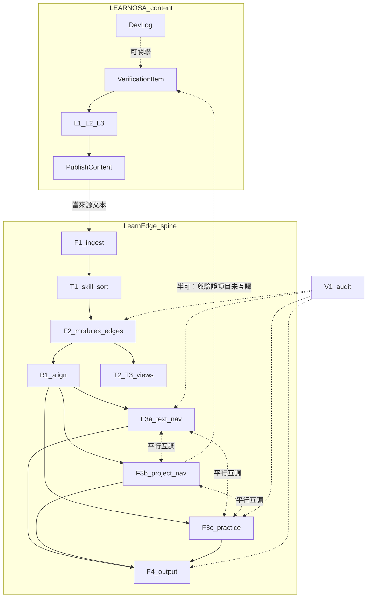
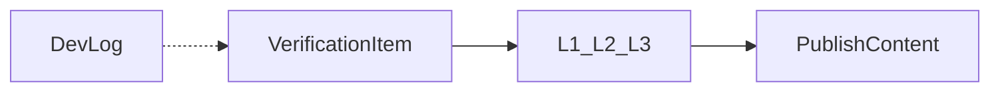
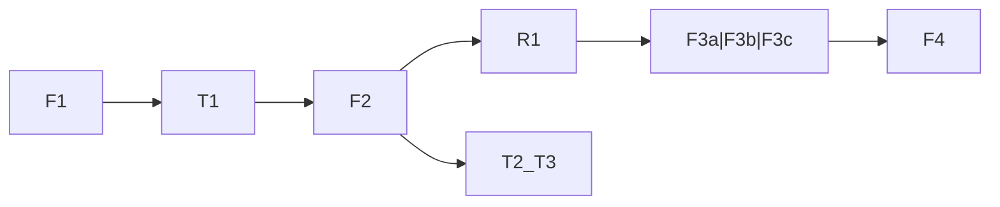

# LEARNOSA × LearnEdge 可跑通參考流程

- 短代號：D35
- 狀態：已封存
- 裁決來源：使用者 2026-08-07 REBUILD1：舊框架硬套無效，批次封存
- 實作參照：[ops-id-legend](../management/ops-id-legend.md)、[bridge](2026-08-04-learnosa-hs-learnedge-bridge.md)、[標準 v0.2](2026-08-04-learnosa-content-standard-v0.2.md)
- 後繼：../rebuild/REBUILD1-framework.md（現行框）；歷史參照

> **用途**：今日能照著走的**聯合參考流程**。內容層掛 F1 上游；管線正線用圖例真相；F3 三平行標清；半殘／未結標為斷點。  
> **不是**作業流程圖（治理 flow-map 不動）、**不是** canonical、**不是** F3a 模型細節全文。

## 1. 硬規則（防疊圖）

1. **F3a／F3b／F3c＝平行入口**，非 a→b→c 流水線。
2. **驗證項目 ≠ GATE**；**驗證完成 ≠ Gate 通過**。
3. LEARNOSA **不登記**成站位／作業模塊。
4. 進 **F1 不因「驗證完成」跳過**候選分流（bridge §3 上游）。
5. **使用迴路、舊九宮／決策牌串法**不得當本圖主路徑。

## 2. 聯合總圖

## 3. 分層小圖

### 3.1 LEARNOSA 內容層

- 開發日誌可獨立存在；要正式判斷才建驗證項目。
- 同一份發布內容可同時是開發日誌與驗證報告；正式判斷以驗證項目為準。

### 3.2 LearnEdge 管線正線

真相來源：[ops-id-legend](../management/ops-id-legend.md)「流程（主路徑）」。

## 4. 可跑／半可／不可

| 區段 | 今日可跑？ | 依據 |
|---|---|---|
| LEARNOSA L1 最小閉環 | **可**（試行） | 標準 v0.2＋[試作](../experiments/2026-08-04-learnosa-content-verification-trial.md) |
| 開發日誌獨立存在 | **可** | 標準 §2.2 |
| 發布→F1→T1→F2→R1 | **可**（管線） | ops-id-legend |
| 進 F1 跳過候選分流 | **不可** | bridge §3 |
| F3a／F3c／F4 作入口 | **可**（細節多草案） | 圖例站位 |
| F3b 專案過關 | **半可** | B-6 已裁；與 LEARNOSA **尚未互譯**（bridge 無 F3b 縫） |
| 使用迴路當總線 | **不可** | 未進圖例；U 站號未裁 |
| 舊九宮／決策牌串法 | **不可** | 九宮放棄；決策投影退出；#75 已結案 |

## 5. 白話走例

**A｜內容→管線（今日最穩）**  
寫開發日誌 → 建 L1 驗證項目（試／見／判）→ 驗證完成 → 發布 → 當來源文本進 F1 → T1→F2→R1。要練習才開 F3c；要對外講才開 F4。L1「另開後續項目」＝新驗證項目，不是 F2 原地擴寫。

**B｜只記過程**  
只寫開發日誌、不建驗證項目 → 仍可發布 → 仍可進 F1；圖內不帶正式判斷詞。

**C｜專案＋F3b（半可）**  
F2 後按需開 F3b：技能書→Gate→Goal（B-6 有／無標準）。Gate 通過 **≠** LEARNOSA 驗證完成；對外「建議採用」仍須 L2 驗證項目＋發布。

**D｜刻意不走**  
使用迴路①～⑥當脊柱、舊「講圖→九宮→訓練」、決策牌站內循環——本參考圖不當主路徑。

## 6. 刻意不畫進去

- 使用迴路①～⑥當脊柱  
- 舊「講圖→導航→九宮→訓練」串法  
- 決策牌／前置閘門站內循環  
- LEARNOSA L2／L3 全模板細節（只保留「有驗證項目→發布→F1」）

## 7. 待補（不阻塞本參考圖使用）

| 項 | 說明 |
|---|---|
| F3b×LEARNOSA 互譯 | 驗證項目 vs GATE／過關判準；待完整待裁或 bridge 增 §F3b |
| #75 結案 | 決策投影退出導航後續；2026-08-05 落 F3a／OSA 現行稿＋母稿封存 | **已結案** |
| 第二題試跑 | 發布→F1 全鏈；見 bridge §7 |
