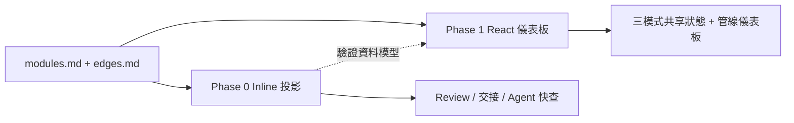

# Inline 交互圖 × 模塊可視化 — 規劃

日期：2026-07-13  
狀態：規劃稿，待使用者確認  
關聯規格：[2026-07-13-knowledge-visualizer-design.md](./2026-07-13-knowledge-visualizer-design.md)

## 問題

Inline 交互圖能否實現 HS LearnEdge 的模塊可視化？若可以，應做到哪個深度；若不足，應如何與既有 React 規格銜接？

## 「Inline 交互圖」在本專案的定義

指**嵌入 Markdown／Agent 回覆、無獨立前端建置**的圖式投影，主要載體如下：

| 載體 | 互動程度 | 典型用途 |
|---|---|---|
| Mermaid（`flowchart` / `graph`） | 低：靜態渲染；部分環境支援節點 click 跳錨 | 管線、鄰域、分層概覽 |
| Markdown 表格 + 折疊區塊 | 中：人工展開／收合 | 流向面板、邊帳本、證據摘要 |
| Agent 按需重繪子圖 | 中：以對話切換視角，非持久 UI 狀態 | 焦點鄰域、單模塊深挖 |
| Cursor／IDE 內嵌預覽 | 低～中：預覽即時，仍非圖形 UI 控件 | 開發與 Review 時快速查閱 |

**不屬於** inline 交互圖的範圍：獨立 React SPA、React Flow 畫布、需部署的互動儀表板。

## 對照既有成功條件

來源：[knowledge-visualizer-design.md](./2026-07-13-knowledge-visualizer-design.md)

| 成功條件 | Inline 能否覆蓋 | 說明 |
|---|---|---|
| 管線總覽（收錄→Dynamic View） | **能（Phase 0）** | 單張 Mermaid flowchart 即可；指標卡改為 Markdown 摘要表 |
| 三種圖譜模式切換 | **部分** | 可產三份獨立 Mermaid；**無法**在同一畫布保留共享選取狀態 |
| 點選模塊 → 固定流向面板 | **部分** | Mermaid click→錨點可行；無固定底欄，需表格／折疊區替代 |
| `background` 黃色虛線節點 | **勉強** | Mermaid 樣式有限；可用虛線框 class，但不如 React Flow 一致 |
| 邊類型篩選、顯示背景開關 | **不能** | 需執行期 UI 狀態；inline 只能預生成多份視圖 |
| 多來源切換 | **部分** | 每來源一份視圖檔或 Agent 動態生成；無下拉選單式即時切換 |
| 溯源至 `module_id` / `char_span` / edge record | **能** | 節點標籤與表格欄位直接寫 ID 與 span |
| 視圖不回寫正式資料 | **能** | 純投影，與 React 版相同 |
| 解析失敗有明確訊息 | **能** | 生成腳本／Skill 輸出警示區塊 |
| 鍵盤無障礙、響應式聚光淡化 | **不能** | Mermaid 非無障礙圖形控件；大圖在窄螢幕可讀性差 |

## 結論

**Inline 交互圖可以實現模塊可視化的「閱讀與審核」子集，不能單獨滿足完整互動規格。**

建議採**雙軌、分階段**策略：

- **Phase 0（Inline）**：低成本、可立即服務 Review 桶與 Agent；驗證解析與語義是否正確。
- **Phase 1（React）**：實作原規格中的互動、篩選、響應式與管線儀表板；JSON 投影格式由 Phase 0 預先對齊。

## Phase 0 範圍（Inline 可交付）

### 產出物

| 路徑 | 內容 |
|---|---|
| `tools/viz/parse-doc-artifacts.mjs` | 解析 `modules.md`、`edges.md` → 中間 JSON（與 Phase 1 共用 schema 草案） |
| `tools/viz/render-inline-views.mjs` | 由 JSON 產生 `views/*.md`（Mermaid + 表格） |
| `DOC/Review/<slug>/views/` | 每來源自動生成的 inline 視圖（不覆寫 `modules.md` / `edges.md`） |
| `.agents/skills/render-knowledge-views/SKILL.md` | 增補「Inline 投影」步驟與產出路徑（小幅修訂） |

### 每來源視圖檔

1. **`pipeline.md`** — 管線階段與產物數摘要（表格 + 單向 flowchart）。
2. **`focus-<module_id>.md`** — 一階上下游子圖；預設為第一個 `is_skill_signal: true` 模塊。
3. **`full-graph.md`** — 全模塊全邊；節點標籤：`中文標題 (Mxx)`。
4. **`argument-layers.md`** — 依 `semantic_roles` 分 subgraph（claim / procedure / evidence 等）。
5. **`flow-panel-<module_id>.md`** — 上游｜本模塊｜下游表格 + 邊帳本 + `char_span` 證據。

### 語義規則（與 React 規格對齊）

- 只載入 canonical 模塊層邊；排除 `broader_than`。
- 箭頭方向：來源模塊 → 被支撐模塊。
- `is_skill_signal: false` 或 `background` 角色 → Mermaid `classDef background` 虛線黃框。
- 懸空端點、未知邊類型 → 不進圖，寫入 `views/_warnings.md`。
- 節點文字用 YAML `claim` / `concept_core` / 標題人話摘要，**不**以摘要代替需溯源的正文。

### 參考資料規模（Review 範例）

來源 `how-to-make-company-ai-native`：9 模塊、19 邊 — **在 Mermaid 可讀上限內**，適合作 Phase 0 試點。

## Phase 1 範圍（維持原 React 規格）

Phase 0 **不取代** [knowledge-visualizer-design.md](./2026-07-13-knowledge-visualizer-design.md)。下列能力仍屬 Phase 1：

- 同一分頁內三模式 **共享** 選取、篩選、背景開關。
- 全圖聚光鏡（高亮連通路徑、淡化其餘節點）。
- 固定底部流向面板與邊點選。
- 管線控制室指標卡與階段 drill-down。
- Production build 與鍵盤／響應式驗收。

Phase 0 的 JSON schema 應作為 Phase 1 的 `SourceRecord` / `ModuleRecord` / `EdgeRecord` 草案，避免重複解析邏輯。

## 建議決策

| 選項 | 適用 | 不適用 |
|---|---|---|
| **A. 僅 Phase 0** | 快速 Review、交接附圖、Agent 對話內查模塊關係 | 需要即時篩選、聚光、多來源 UI |
| **B. Phase 0 → Phase 1** | 先驗證資料與語義，再投 React | 想跳過解析直接做 UI |
| **C. 僅 Phase 1** | 一次到位完整互動 | 希望零建置、純 Markdown 工作流 |

**推薦：B。** Inline 先證明 `modules.md` / `edges.md` 可穩定投影；React 再承接互動缺口。

## Phase 0 實作任務（待確認後執行）

- [ ] **Task 1**：定義 `tools/viz/schema/` JSON 草案（Module / Edge / PipelineSummary）
- [ ] **Task 2**：實作 `parse-doc-artifacts.mjs`，通過 Review 範例（9 模塊、19 邊一致）
- [ ] **Task 3**：實作 `render-inline-views.mjs`，產出五類視圖檔
- [ ] **Task 4**：對 `DOC/Review/how-to-make-company-ai-native/` 生成首套 `views/`
- [ ] **Task 5**：更新 `render-knowledge-views` Skill — Inline 投影步驟與驗收
- [ ] **Task 6**：文件 — 在 knowledge visualizer 規格加「Phase 0 / Phase 1 分工」交叉引用

## 驗收（Phase 0）

- 解析後模塊數、邊數與源檔一致。
- 三份圖（focus / full / layers）邊方向與類型正確。
- `background` 節點樣式可辨識。
- 每節點、每邊可從視圖追溯到 `module_id` 或 evidence span。
- `views/_warnings.md` 在故意缺欄測試時有明確訊息。
- 不修改 `modules.md`、`edges.md`、登記簿或原文。

## 待使用者確認

1. 「Inline 交互圖」是否指 **Mermaid + Markdown 投影**（上述定義）？若指其他工具，需調整 Phase 0 載體。
2. 是否採 **推薦方案 B**（Phase 0 先行，React 後續）？
3. Phase 0 首個試點是否固定為 `DOC/Review/how-to-make-company-ai-native/`？

確認後可另開 implementation plan（checkbox 任務格式），並在 `cursor/inline-diagram-viz-plan-2c21` 或後續實作分支執行。
